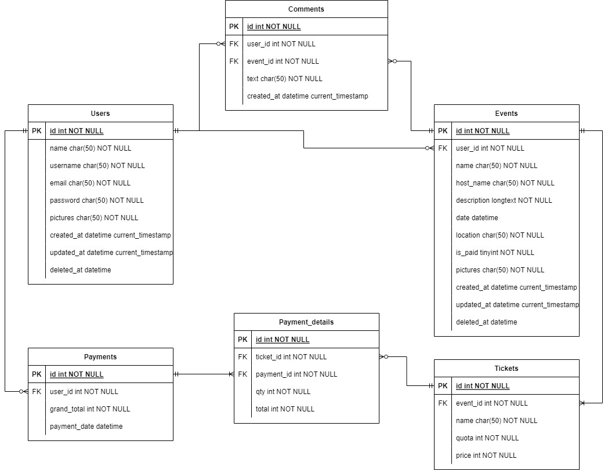

## 📑 About the Project
<p align="justify">Event Planning App. Users can post event and users can join events from each other.<br>
  <br>
This RESTful API was developed by using Golang and written based on Clean Architecture principles. Built with Echo as web framework, GORM as ORM, MySQL as DBMS, etc.
</p>

## 🛠 Tools
**Backend:** <br>


**Deployment:** <br>


**Communication:**  


# 🔗 ERD


# 🔥 Open API

Simply [click here](https://app.swaggerhub.com/apis-docs/CW3-ALTA/EventPlanningApp/1.0.0) to see the details of endpoints we have agreed with our FE team.

<details>
  <summary>👶 User </summary>
  
| Method      | Endpoint            | Params      |q-Params            | JWT Token   | Function                                |
| ----------- | ------------------- | ----------- |--------------------| ----------- | --------------------------------------- |
| POST        | /register           | -           |-                   | NO          | Register a new Use                      |
| POST        | /login              | -           |-                   | NO          | Login to the system                     |
| GET         | /users              | -           |-                   | YES         | Show user profile                       |
| PUT         | /users              | -           |-                   | YES         | Update user profile                     |
| DELETE      | /users              | -           |-                   | YES         | Update user profile                     |


  
</details>

<details>
  <summary>📑 Event</summary>
  
| Method      | Endpoint            | Params      | JWT Token   | Function                                |
| ----------- | ------------------- | ----------- | ----------- | --------------------------------------- |
| POST        | /events             | -           | YES         | Post a events                            |
| GET         | /events             | -           | NO          | Get All event                            |
| GET         | /myevent            | -           | YES         | Get MyEvents                             |
| PUT         | /events             | events_id   | YES         | Edit event                              |
| DELETE      | /events             | events_id   | YES         | Delete event                             |
| GET         | /events             | events_id   | NO          | Get events Detail                        |  

  </details>
     <details>
  <summary>📠 Ticket</summary>
  
| Method      | Endpoint            | Params      | JWT Token   | Function                                |
| ----------- | ------------------- | ----------- | ----------- | --------------------------------------- |
| POST        | /tickets            | -           | YES         | Make Event Ticket                   |
| PUT         | /tickets            | tickets_id  | YES         | Edit Ticket                    |


  </details>
  <details>
   <summary>🔊 Comment</summary>
  
| Method      | Endpoint            | Params      | JWT Token   | Function                                |
| ----------- | ------------------- | ----------- | ----------- | --------------------------------------- |
| POST        | /comments           | -           | YES         | Make Event Comment                          |


</details>
  <details>
   <summary>📑 Payment</summary>
  
| Method      | Endpoint                      | Params      | JWT Token   | Function                                |
| ----------- | ----------------------------- | ----------- | ----------- | --------------------------------------- |
| POST        | /reservations                 | -           | YES         | Make Reservations for Join Event        |
| POST        | /payments/notifications       | -           | YES         | Make payments notifications        |


  </details>
    
 

# 🛠️ How to Run Locally

- Clone it

```
$ git clone https://github.com/ALTA-PROJECT3-GROUP3/EventPlanningApp-BE.git
```

- Go to directory

```
$ cd EventPlanningApp-BE
```
- Run the project
```
$ go run .
```

- Voila! 🪄

### 🧰Backend

- [Github Repository for the Backend team](https://github.com/ALTA-PROJECT3-GROUP3/EventPlanningApp-BE)
- [Swagger OpenAPI](https://app.swaggerhub.com/apis-docs/CW3-ALTA/EventPlanningApp/1.0.0)


# 🤖 Author

-  Adi Yuda Pranata  <br>  [](https://github.com/Adiyuda123)
-  Kristain Putra <br>  [](https://github.com/kristain09)
-  Haris <br>  [](https://github.com/ares0177)


<h5>
<p align="center">Created by Group 3 ©️ 2023</p>
</h5>
